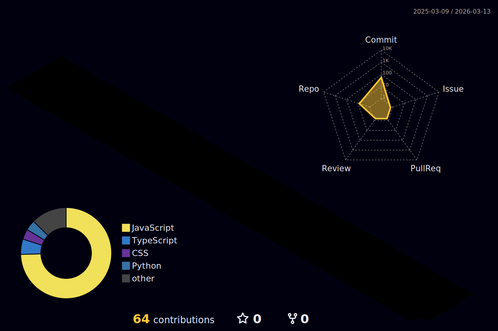

<div align="center">

<!-- Animated Header -->


<!-- Typing Animation -->
<a href="https://git.io/typing-svg"></a>

<!-- Fancy Divider -->


### 🐾 Welcome to my digital catnip! 🐾

*Meow-vie developer by day, bug hunter by night*  
*Currently purring over: AI Projects & Web Development*

<!-- Visitor Counter with Animation -->
<p align="center">
  
  
  
</p>

</div>

---

## 🎯 About This Red Hat Cat

```python
class RedHatCat:
    def __init__(self):
        self.username = "nishika25-ta"
        self.role = "Full Stack Developer"
        self.location = "IT World 🌍"
        self.motto = "Curiosity didn't kill this cat - it made me a developer!"
        
        self.languages = ["Python", "JavaScript", "TypeScript"]
        self.current_projects = [
            "🤖 Darklace-AI - AI Meeting Assistant",
            "🧠 XAI - Explainable AI for PE Analysis", 
            "💼 Portfolio Projects - Showcasing my work"
        ]
        
    def say_hello(self):
        print("Meow! 🐱 Thanks for stopping by!")
        
    def current_status(self):
        return {
            "coding": "Always",
            "learning": "Every day",
            "drinking_coffee": "Constantly ☕",
            "wearing_red_hat": "Of course! 🎩"
        }

red_hat_cat = RedHatCat()
red_hat_cat.say_hello()
```

---

## 🛠️ Tech Stack & Skills

<div align="center">

### 💻 Languages


### 🚀 Frameworks & Libraries


### 🗄️ Databases & Tools


### ☁️ Cloud & DevOps


</div>

---

## 📊 GitHub Statistics

<div align="center">

<a href="https://github.com/nishika25-ta">
  
  
</a>

</div>

<div align="center">

<!-- GitHub Streak Stats -->


</div>

---

## 💻 Coding Stats

<div align="center">

<!--START_SECTION:waka-->

<!-- WakaTime stats will appear here after setup -->


<!--END_SECTION:waka-->

</div>

---

## 📈 Profile Metrics

<div align="center">


</div>

---

## 🏆 GitHub Trophies

<div align="center">


</div>

---

## 🌟 Featured Projects

<div align="center">

<!-- Darklace-AI Repository Card -->
<a href="https://github.com/nishika25-ta/Darklace-AI">
  
</a>

<!-- XAI Repository Card -->
<a href="https://github.com/nishika25-ta/XAI">
  
</a>

</div>

<br/>

<div align="center">

<!-- Portfolio Repository Card -->
<a href="https://github.com/nishika25-ta/valentineagam-portfolio">
  
</a>

</div>

---

## 📈 Contribution Graph

<div align="center">

<!-- 3D Contribution Calendar -->


<!-- Activity Graph -->


</div>

---

## 🐍 Contribution Snake

<div align="center">

<!-- Snake eating contributions -->
<picture>
  <source media="(prefers-color-scheme: dark)" srcset="https://raw.githubusercontent.com/nishika25-ta/nishika25-ta/output/github-contribution-grid-snake-dark.svg">
  <source media="(prefers-color-scheme: light)" srcset="https://raw.githubusercontent.com/nishika25-ta/nishika25-ta/output/github-contribution-grid-snake.svg">
  
</picture>

</div>

---

## 💭 Random Dev Quote

<div align="center">


</div>

---

## 🎵 Currently Vibing To

<div align="center">

<!-- Spotify Widget - Optional: Replace with your Spotify link if you want -->
[](https://open.spotify.com/user/spotify)

*When I'm not coding, I'm probably jamming to some tunes! 🎧*

</div>

---

## 📫 Connect With Me

<div align="center">

### Let's collaborate and build something amazing together! 🚀

<!-- Social Badges -->
[](https://github.com/nishika25-ta)
[](https://linkedin.com/in/your-profile)
[](https://your-portfolio-url.com)
[](mailto:your-email@example.com)

<br/>

### 💬 Fun Cat Facts

```
😺 Cats spend 70% of their lives sleeping
🐱 I spend 70% of my life coding
👨‍💻 We're not so different!
```

---

### 🎯 Current Goals for 2025

- 🚀 Build more AI-powered applications
- 📚 Master system design and architecture
- 🌟 Contribute to open source projects
- 🐱 Continue being the coolest Red Hat Cat in IT
- ☕ Drink even more coffee (if that's possible)

---


### 🐾 Remember: Stay curious, keep coding, and always wear your red hat! 🎩

<sub>⭐ From [nishika25-ta](https://github.com/nishika25-ta) with 💖 and lots of ☕</sub>

</div>
