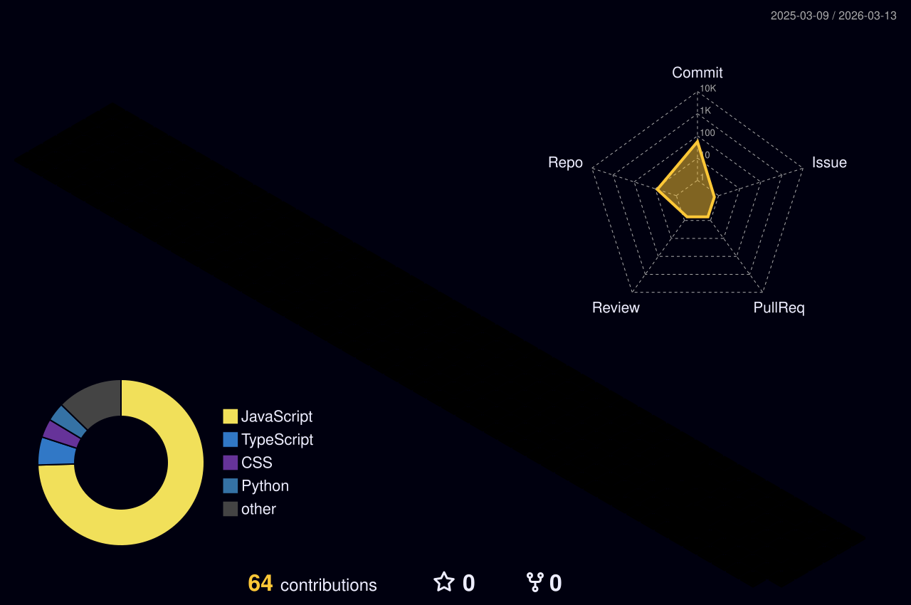

<!-- Hero Banner -->

  

<!-- Animated Typing Subtitle -->

  

<!-- Status Badges -->

  
  
  

 

<!-- About -->
## About

Hey there. I'm a full stack developer obsessed with building elegant, performant systems and the kind of small details that make software feel alive. I work across AI integration, modern web apps, and the design layer that ties them together.

**Currently focused on**

- AI / ML engineering and integration
- Full stack web applications
- Modern UI / UX design systems
- Cloud-native architecture

 

<!-- Tech Stack -->
## Tech Stack

  

  
  
  
  
  
  
  
  
  
  

 

<!-- GitHub Stats -->
## GitHub Stats

  <a href="https://github.com/nishika25-ta">
    <picture>
      <source media="(prefers-color-scheme: dark)" srcset="https://github-readme-stats.vercel.app/api?username=nishika25-ta&show_icons=true&theme=tokyonight&hide_border=true&include_all_commits=true&count_private=true&card_width=450&title_color=58a6ff&icon_color=58a6ff"/>
      
    </picture>
  </a>
  <a href="https://github.com/nishika25-ta">
    <picture>
      <source media="(prefers-color-scheme: dark)" srcset="https://github-readme-stats.vercel.app/api/top-langs/?username=nishika25-ta&layout=compact&theme=tokyonight&hide_border=true&langs_count=8&card_width=340&title_color=58a6ff"/>
      
    </picture>
  </a>

<!-- Streak -->

  <a href="https://github.com/nishika25-ta">
    <picture>
      <source media="(prefers-color-scheme: dark)" srcset="https://streak-stats.demolab.com?user=nishika25-ta&theme=tokyonight&hide_border=true&background=00000000&ring=58a6ff&fire=58a6ff&currStreakLabel=58a6ff"/>
      
    </picture>
  </a>

 

<!-- Trophies -->
## Trophies

  <a href="https://github.com/nishika25-ta">
    <picture>
      <source media="(prefers-color-scheme: dark)" srcset="https://github-profile-trophy.vercel.app/?username=nishika25-ta&theme=tokyonight&no-frame=true&no-bg=true&row=1&column=7&margin-w=10&margin-h=10"/>
      
    </picture>
  </a>

 

<!-- Activity Graph -->
## Activity

  <a href="https://github.com/nishika25-ta">
    <picture>
      <source media="(prefers-color-scheme: dark)" srcset="https://github-readme-activity-graph.vercel.app/graph?username=nishika25-ta&theme=tokyo-night&bg_color=00000000&color=58a6ff&line=58a6ff&point=ffffff&area=true&hide_border=true&custom_title=Contribution%20Activity"/>
      
    </picture>
  </a>

 

<!-- Featured Projects -->
## Featured Projects

  <a href="https://github.com/nishika25-ta/Darklace-AI">
    <picture>
      <source media="(prefers-color-scheme: dark)" srcset="https://github-readme-stats.vercel.app/api/pin/?username=nishika25-ta&repo=Darklace-AI&theme=tokyonight&hide_border=true&title_color=58a6ff&icon_color=58a6ff"/>
      
    </picture>
  </a>
  <a href="https://github.com/nishika25-ta/XAI">
    <picture>
      <source media="(prefers-color-scheme: dark)" srcset="https://github-readme-stats.vercel.app/api/pin/?username=nishika25-ta&repo=XAI&theme=tokyonight&hide_border=true&title_color=58a6ff&icon_color=58a6ff"/>
      
    </picture>
  </a>

  <a href="https://github.com/nishika25-ta/valentineagam-portfolio">
    <picture>
      <source media="(prefers-color-scheme: dark)" srcset="https://github-readme-stats.vercel.app/api/pin/?username=nishika25-ta&repo=valentineagam-portfolio&theme=tokyonight&hide_border=true&title_color=58a6ff&icon_color=58a6ff"/>
      
    </picture>
  </a>

 

<!-- 3D Contribution Calendar -->
## 3D Contribution Calendar

  

 

<!-- Snake Animation -->
## Contribution Snake

  <picture>
    <source media="(prefers-color-scheme: dark)" srcset="https://raw.githubusercontent.com/nishika25-ta/nishika25-ta/output/github-contribution-grid-snake-dark.svg"/>
    
  </picture>

 

<!-- Connect -->
## Connect

  

 

<!-- Quote -->

  <i>"First, solve the problem. Then, write the code."</i> 
  — Donald Knuth

<!-- Footer Wave -->

  

